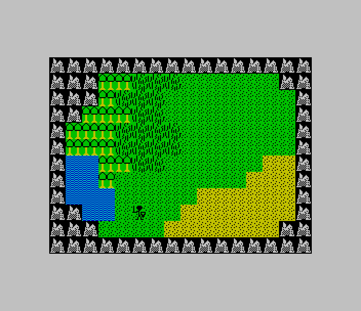

# Ten Minute Adventure
 
Ten Minute Adventure is a tiny CRPG for the Timex Sinclair 2068. Its purpose is to teach the author Z80 assembly language for the TS2068, provide a small but playable game for the platform, and possibly to provide an engine for other, better games. It is licensed under the MIT license so that code from it can be used freely in other projects.
 

 
## Building

Ten minute adventure can be built with pasmo via the following: `pasmo --tapbas tma.asm tma.tap`, after which the .tap file can be loaded into an emulator or onto a real Timex Sinclair 2068 with a TS-Pico, or whatever else people do with .tap files. It can probably be built with other Z80 assemblers, although some adjustments to the assembler directives may be necessary.

## Known Issues

Ten Minute adventure is currently in early development, so it may have bugs. However, no serious issues are known to the author at this time.

## TODO

Ten Minute Adventure is a work in progress with many features yet to be completed:

* Multiple screens
* Player stats: HP, MP, exp, level
* Weapons and armor
* Magic
* Combat
* Move to maps other than the overworld (towns, dungeons)
* Background music
